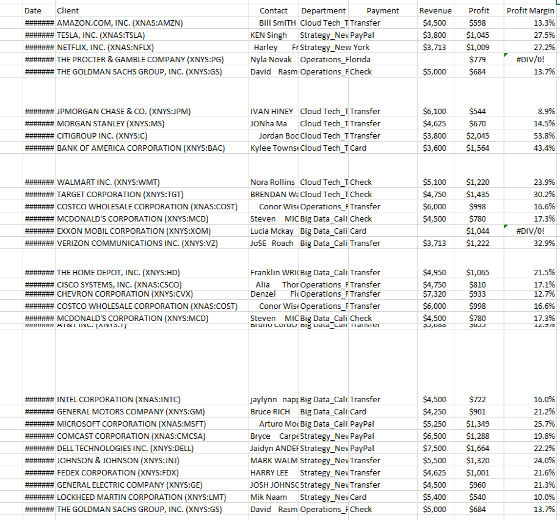
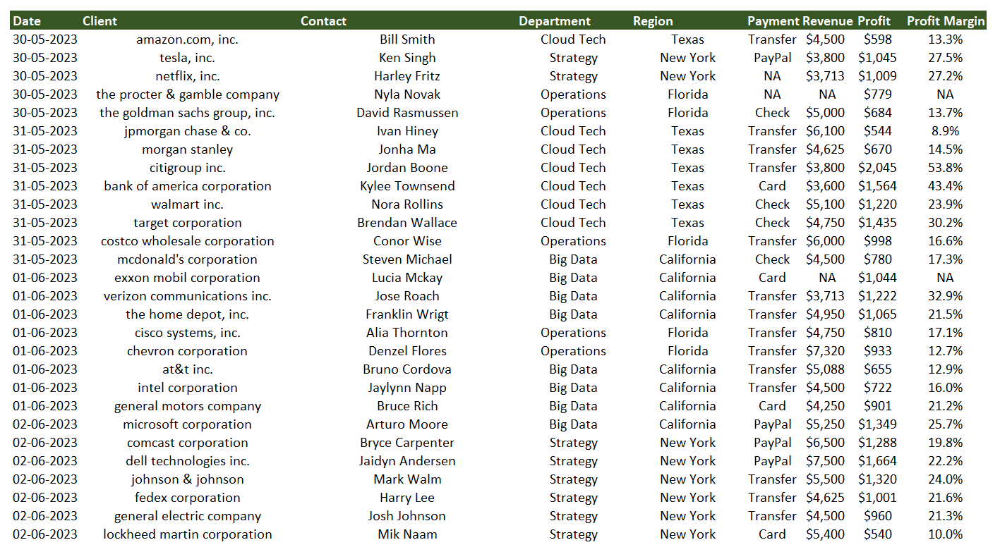

# Data cleaning in excel 

Project Description:
This project project  deals with cleaning different errors in excel and creating an user frendly and readable table for furthur data analysis. 

**Step 1:** 
Here we autofit the rows and column in order to make the contents more readable.

*Shortcut-First select the conthent then press( Alt+H+O+I )*

**Step 2:** 
There is a client name section and there we search and replace the conents in bracket with nothing.

**Step 3:** 
Then columns containing random format are converted into proper upper and lower case format (using "proper case" function) and unnecessary spaces are removed by "Trim" function.

**Step 4:** 
The department column given in the table has department and state mixed togather differentiated by underscore, they are sepearated using text to columns in data section, the delimiters used here was underscore.

**Step 5:** 
The duplicate values are removed by "Remove Duplicates" option in data section

**Step 6:** 
In the given table there are lots of empty cells. First we select the "Find and Select" then "Select Special" and finally we sellect "Blank". This process selects all the empty cells then we go to the formula bar and type NA and press "Ctrl+Enter" to replace all empty cells with "NA"

**Step 7:** 
Some of the cells in a column calculated by formula contains error, Here we use the "iferror" formula, (=iferror(formula used for calculation, here its (Profit cell / Revenue cell), "NA")). This formula replaces error with NA.

## Before Cleaning

## After Cleaning

## Acknowledgements

Kenji Farre 

Video link "https://www.youtube.com/watch?v=jxq4-KSB_OA&ab_channel=KenjiExplains"

