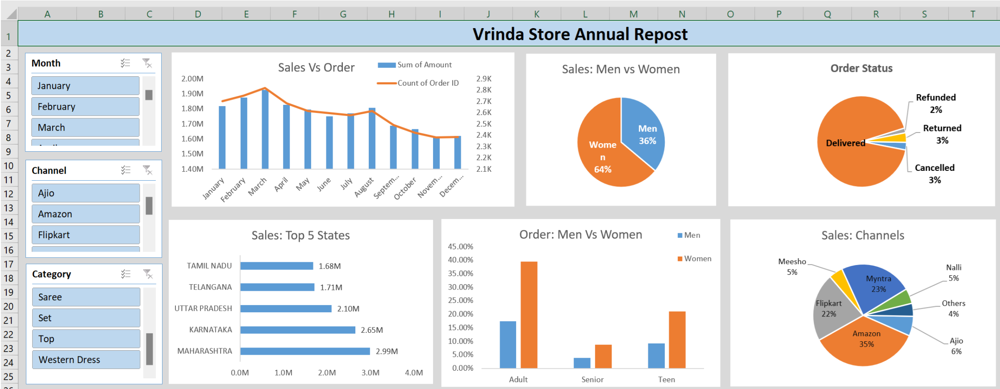

# Vrinda Stores Annual Report

Annual Sales Report Project
In this comprehensive project, our primary objective is to transform a disorganized set of data into a valuable and insightful annual sales report for a store. Employing a meticulous approach, we embark on a journey of data exploration, analysis, and visualization to extract meaningful trends, patterns, and performance metrics.

Data Organization and Understanding
The first crucial step involves delving into the raw data, understanding its structure, and organizing it for effective analysis. We meticulously review the dataset, identifying variables, data types, and potential areas of improvement. By addressing missing values, duplicates, and inconsistencies, we lay the foundation for a robust and reliable analysis.

## Data Cleaning
The original dataset at first is processed in excel. The data is processed in a structured manner, with columns for each category and header are created.

Null values, errors, duplicate values, and missing data sections are rectified. 

The formula for columns were rechecked and if errors are observed it is corrected.
## Data Analysis 
For analysis of the data pivot tables are created. Filters are applied for sorting and gaining insight values from table data.

Pivot charts along with conditional formatting are created fot the required KPI.

Slicers are added for interactive filtering.

## Data Visualization

Different charts and graphs are created for visualization, all of the visualization are done in excel.

The list of parameter and chart types are given below:

| Chart Parameter | Chart type | 
| -------- | -------- |  
| Sales ( State Wise )   | Clustered Bar  | 
| Sales ( Channel wise )  | Pie    | 
| Order ( Man vs Women & age )   | Clustered column  | 
| Sales ( Order Wise )  | Combo (Line(Secondary axis) and column)   | 
| Sales ( Man and Woman )   | Pie  |  
| Order (Order Status wise)   | Pie  | 

### Dashboard View 

## Insight

1 Women are more likely to buy compared to men(65%)

2 Maharastra, Karnataka, UP are the top 3 states in terms of Sale

3 Adult Group (age: 30-49) are max contributing to sales

4 Amazon, Flipkart and Myntra are the best channels

### Action based on insight

Target  female customers of age (30-49) who lives in Maharastra,Karnataka,UP by giving ad/offer/coupon on Amazon Flipkart and Myntra

## Acknowledgements

Rishabh Mishra

Video Link: https://www.youtube.com/watch?v=gTK5rNhWJyA&ab_channel=RishabhMishra

